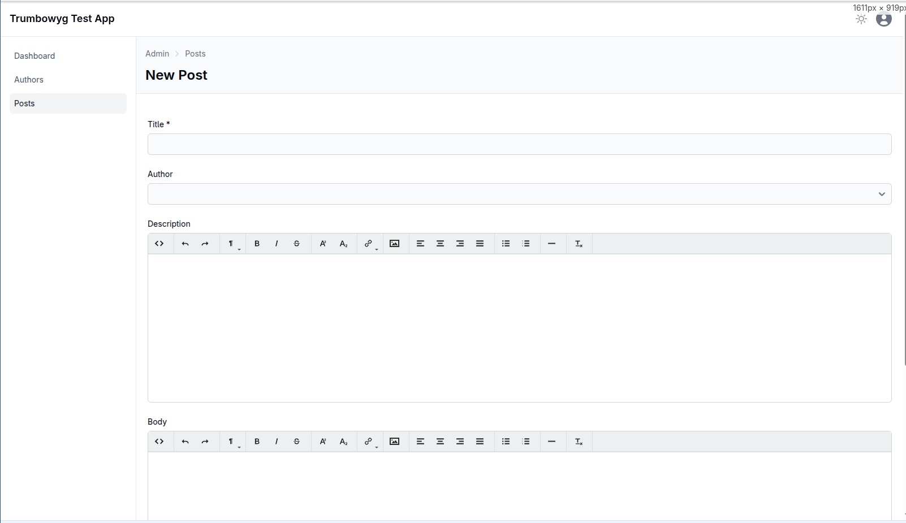
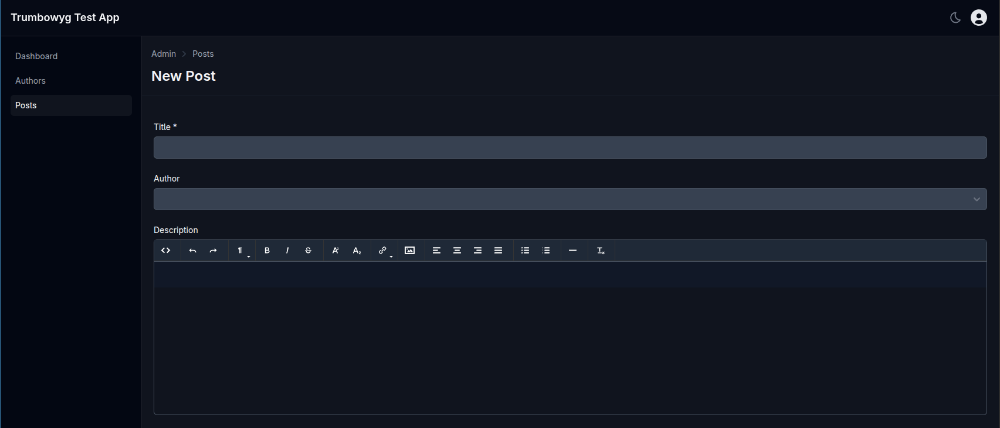

# Active Admin Trumbowyg

> **⚠️ NOTE: ActiveAdmin 4 support - Production build not yet tested**  
> The gem has been updated for ActiveAdmin 4.0+ and works in development environments.  
> Production deployment with asset precompilation has not been fully tested yet.  
> Use version 1.x for ActiveAdmin 3.x applications.

[](https://github.com/glebtv/activeadmin_trumbowyg/actions/workflows/ci.yml)

An *Active Admin* plugin to use [Trumbowyg](https://alex-d.github.io/Trumbowyg/) as WYSIWYG editor in form inputs.

Features:
- automatically includes a fast & lightweight rich editor in Active Admin;
- customizable options via data attributes in the form input;
- plugins included, like images upload;
- dark mode support for ActiveAdmin 4.

### Light Mode


### Dark Mode


Please :star: if you like it.

## Version 2.0 - ActiveAdmin 4 Support

This version supports **ActiveAdmin 4.x only**. For ActiveAdmin 1.x - 3.x support, please use version 1.x of this gem.

### Requirements

- Ruby >= 3.2
- Rails >= 7.0
- ActiveAdmin ~> 4.0.0.beta

## Install

### Step 1: Add the gem

Add to your Gemfile:

```ruby
gem 'activeadmin_trumbowyg', '~> 2.0'
```

Then run `bundle install`.

### Step 2: Configure JavaScript

ActiveAdmin 4 uses modern JavaScript bundlers. Run the installation generator based on your setup:

#### For esbuild (recommended)

```bash
rails generate active_admin:trumbowyg:install --bundler=esbuild
```

This will:
- Install the npm packages (`@activeadmin/trumbowyg`, `jquery`, `trumbowyg`)
- Update your `app/javascript/active_admin.js` file
- Add Trumbowyg styles to your ActiveAdmin stylesheet

#### For importmap

```bash
rails generate active_admin:trumbowyg:install --bundler=importmap
```

This will:
- Add pins to your `config/importmap.rb`
- Copy vendor JavaScript files
- Add Trumbowyg styles to your ActiveAdmin stylesheet

#### For webpack

```bash
rails generate active_admin:trumbowyg:install --bundler=webpack
```

This will:
- Install the npm packages
- Update your webpack configuration
- Add Trumbowyg styles to your ActiveAdmin stylesheet

### Step 3: Use in your forms

```ruby
ActiveAdmin.register Article do
  form do |f|
    f.inputs 'Article' do
      f.input :title
      f.input :description, as: :trumbowyg
      f.input :published
    end
    f.actions
  end
end
```

### Step 4: Production setup

For production environments with asset precompilation, run:

```bash
rails trumbowyg:nondigest
```

This ensures icon assets are available in production.

## Manual Installation (Alternative)

If you prefer manual setup or need custom configuration:

### For esbuild

1. Install npm packages:
```bash
npm install @activeadmin/trumbowyg jquery trumbowyg
```

2. In `app/javascript/active_admin.js`:
```javascript
import $ from 'jquery';
import 'trumbowyg';

// Ensure jQuery is globally available
window.$ = window.jQuery = $;

// Import Trumbowyg initialization
import '@activeadmin/trumbowyg';
```

3. In `app/assets/stylesheets/active_admin.scss`:
```scss
// Trumbowyg Editor
@import url('https://cdn.jsdelivr.net/npm/trumbowyg@2/dist/ui/trumbowyg.min.css');
```

### For importmap

1. In `config/importmap.rb`:
```ruby
pin "jquery", to: "https://cdn.jsdelivr.net/npm/jquery@3.7.1/dist/jquery.min.js"
pin "trumbowyg", to: "https://cdn.jsdelivr.net/npm/trumbowyg@2/dist/trumbowyg.min.js"
pin "activeadmin-trumbowyg", to: "activeadmin-trumbowyg.js"
```

2. Copy the vendor file:
```bash
cp vendor/assets/javascripts/activeadmin-trumbowyg.js app/assets/javascripts/
```

3. In `app/javascript/application.js`:
```javascript
import "jquery"
import "trumbowyg"
import "activeadmin-trumbowyg"
```

## Usage

### Basic usage

```ruby
form do |f|
  f.inputs 'Article' do
    f.input :title
    f.input :description, as: :trumbowyg
    f.input :published
  end
  f.actions
end
```

### With custom options

The **data-options** attribute allows you to pass Trumbowyg configuration directly. For reference see [options list](https://alex-d.github.io/Trumbowyg/documentation/).

```ruby
f.input :description, as: :trumbowyg, input_html: { 
  data: { 
    options: { 
      btns: [
        ['bold', 'italic'], 
        ['superscript', 'subscript'], 
        ['link'], 
        ['justifyLeft', 'justifyCenter', 'justifyRight', 'justifyFull'], 
        ['unorderedList', 'orderedList'], 
        ['horizontalRule'], 
        ['removeformat']
      ] 
    } 
  } 
}
```

## Plugins

### Upload plugin

Plugin reference [here](https://alex-d.github.io/Trumbowyg/documentation/plugins/#plugin-upload).

Add to your JavaScript file (after importing trumbowyg):

```javascript
import 'trumbowyg/dist/plugins/upload/trumbowyg.upload.js';
```

Form field config:

```ruby
unless resource.new_record?
  f.input :description, as: :trumbowyg, input_html: { 
    data: { 
      options: { 
        btns: [['bold', 'italic'], ['link'], ['upload']], 
        plugins: { 
          upload: { 
            serverPath: upload_admin_post_path(resource.id), 
            fileFieldName: 'file_upload' 
          } 
        } 
      } 
    } 
  }
end
```

Upload action (using ActiveStorage):

```ruby
member_action :upload, method: [:post] do
  result = { success: resource.images.attach(params[:file_upload]) }
  result[:file] = url_for(resource.images.last) if result[:success]
  render json: result
end
```

For a complete upload example, see [examples/upload_plugin_using_activestorage/](examples/upload_plugin_using_activestorage/).

## Migration from version 1.x

If upgrading from version 1.x:

1. Update Ruby to >= 3.2 and Rails to >= 7.0
2. Update to ActiveAdmin 4.x
3. Remove old asset pipeline configurations:
   - Remove `//= require activeadmin/trumbowyg/trumbowyg` from `active_admin.js`
   - Remove `//= require activeadmin/trumbowyg_input` from `active_admin.js`
   - Remove `@import 'activeadmin/trumbowyg/trumbowyg';` from `active_admin.scss`
   - Remove `@import 'activeadmin/trumbowyg_input';` from `active_admin.scss`
4. Run the installation generator for your bundler (see Step 2 above)

## Troubleshooting

### Trumbowyg not initializing

Make sure jQuery and Trumbowyg are loaded before the initialization script. Check your browser console for errors.

### Icons not showing in production

Run `rails trumbowyg:nondigest` to copy icon assets for production use.

### Custom plugins not working

Ensure you're importing the plugin JavaScript files after the main Trumbowyg library.

## Changelog

The changelog is available [here](CHANGELOG.md).

## Contributing

Bug reports and pull requests are welcome on GitHub at https://github.com/glebtv/activeadmin_trumbowyg.

## Development

For development information please check [this document](extra/development.md).

## Do you like it? Star it!

If you use this component just star it. A developer is more motivated to improve a project when there is some interest. My other [Active Admin components](https://github.com/blocknotes?utf8=✓&tab=repositories&q=activeadmin&type=source).

Or consider offering me a coffee, it's a small thing but it is greatly appreciated: [about me](https://www.blocknot.es/about-me).

## License

The gem is available as open-source under the terms of the [MIT](LICENSE.txt).